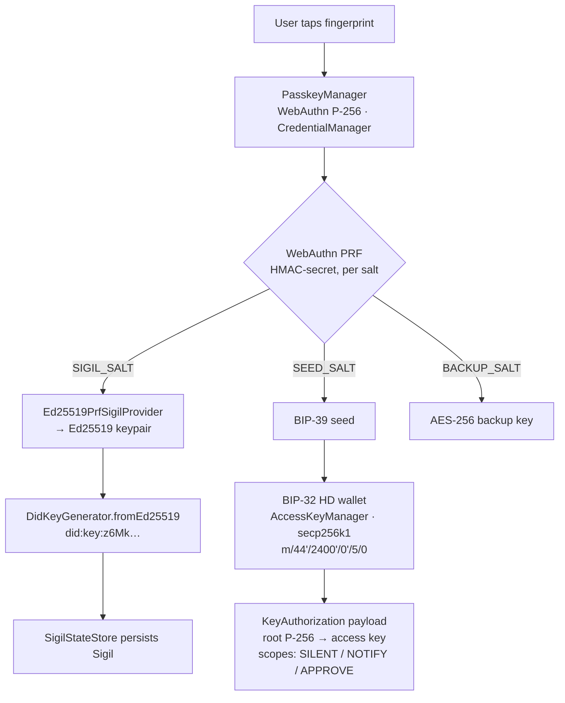
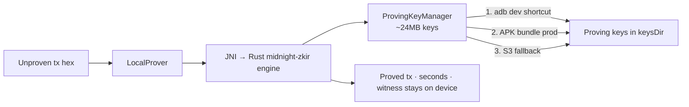
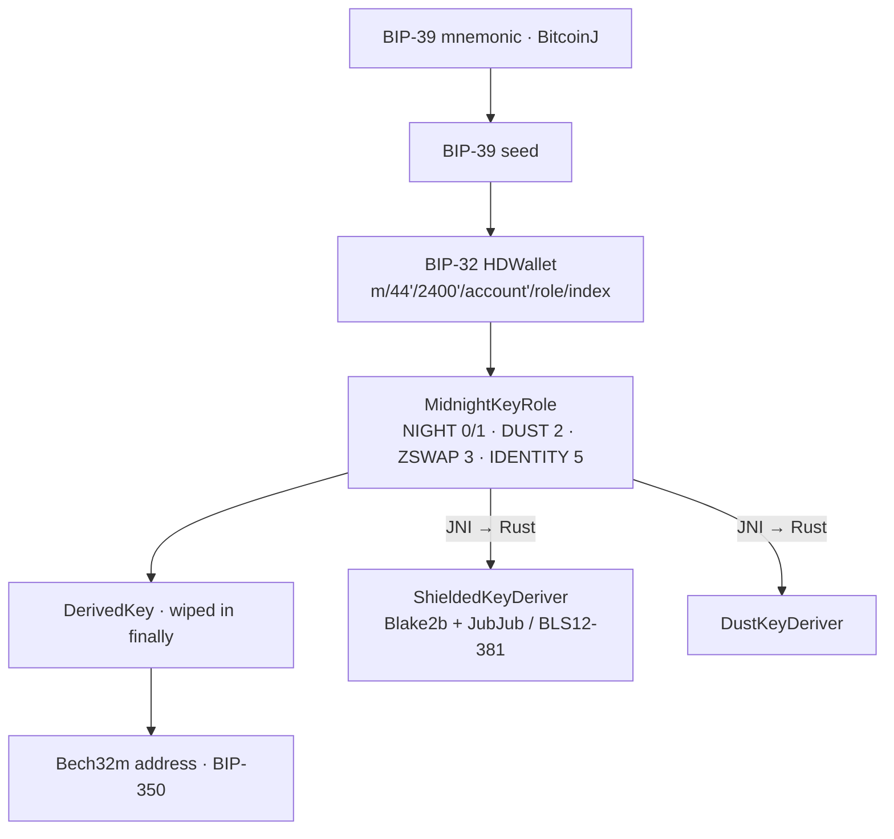
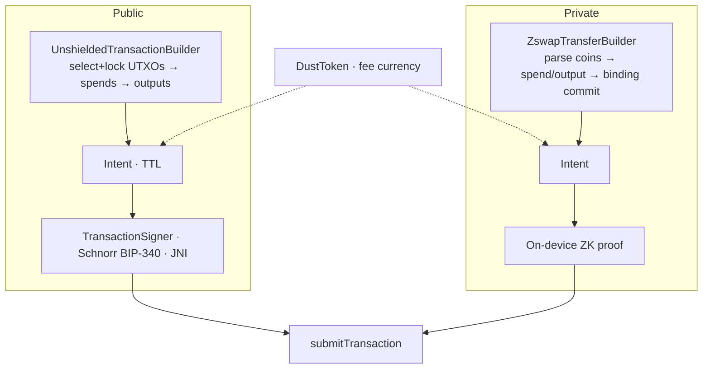
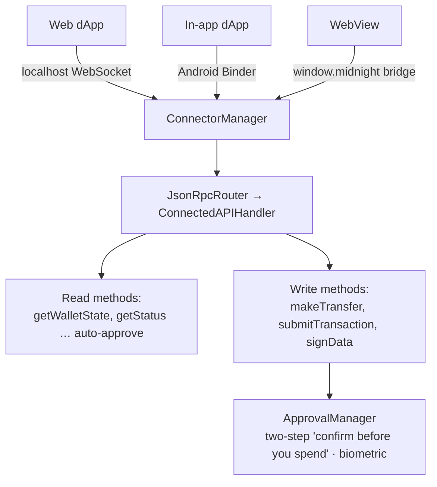
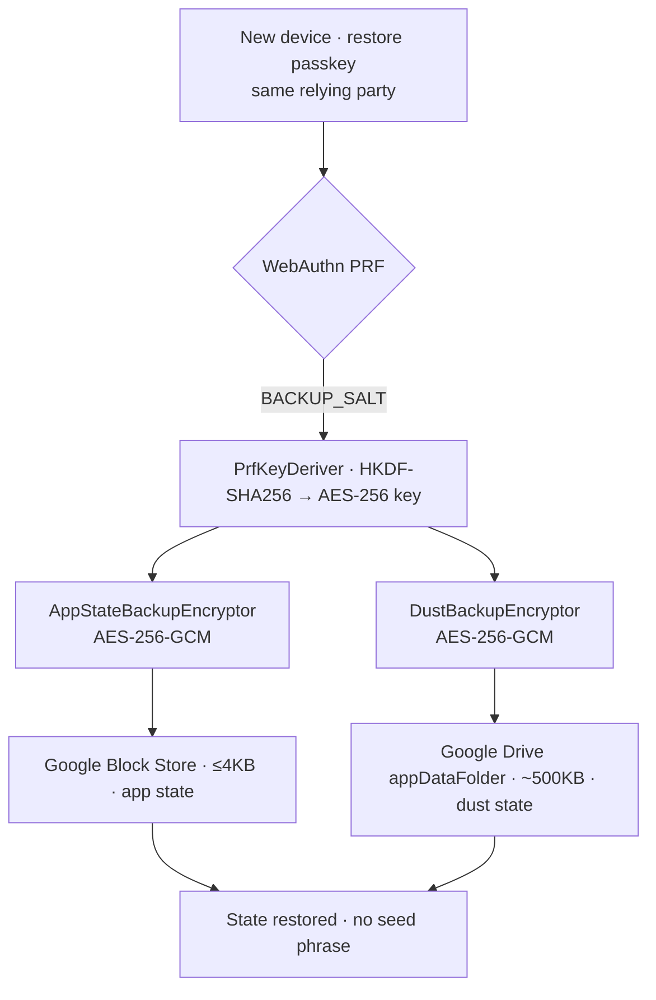

# Kuira Dev Hangout — The SDK, end to end

*Presenter script + reference for a 30–40 min developer hangout.*
*Kuira is not a wallet. It's a Sigil. This doc is the long version of that sentence — the story, the answers to the hard questions, and a simple flowchart for every module.*

---

## How to run this session (30–40 min)

| Time | Segment | What you're doing |
|---|---|---|
| **0:00–4:00** | **The hook** | The shape everyone copied ("connect wallet"), and the one sentence that started Kuira. |
| **4:00–8:00** | **What a Sigil is** | Identity / Authority / State. Show that the Sigil is *literally in the code*, not a slide metaphor. |
| **8:00–14:00** | **Why I built it** | Identity vs. custody. Why I didn't root it in Google/Discord the way zkLogin/web3auth do. |
| **14:00–28:00** | **What's in the box** | Module-by-module with the flowcharts: Identity → On-device Proving → Crypto → Transactions → Connector → Recovery. This is the meat. |
| **28:00–34:00** | **What I built with it** | `kuira-starter-android` (the 5-minute template) and a fast live touch of **Midnight Kicks**. |
| **34:00–40:00** | **Call to action + Q&A** | The `SigilIdentityProvider` seam and where I need help. |

> **If you're tight on time, compress to 30:** trim the zkLogin/web3auth contrast to one line (8–14 → ~3 min) and show only three flowcharts live — **Identity, On-device Proving, Recovery** — leaving Crypto / Transactions / Connector as "read these in the doc." That still lands the whole arc: what / why / out-of-the-box / built-with / CTA.

---

## 1. The hook — the thing everyone copied

Every chain inherited the same shape: **install a wallet, then "connect wallet" to everything you do.** The wallet is a separate app standing at the door; you go *to* it to sign. Lace and 1AM are excellent at that shape — but it's still that shape: one wallet app in the middle, a little "Connect Wallet" modal in front of every experience.

Midnight's own CTO put the uncomfortable question simply: **"You shouldn't need a wallet."**

That sentence is the seed of Kuira.

> **Talk track:** This is also the "I was ideating with my friend last night and landed on this exact thing" moment. The instinct people keep arriving at independently — social login, embedded wallets, no seed phrase — is real. Kuira is one answer to it, with a specific opinion about *where the identity is rooted*. That opinion is the whole talk.

---

## 2. What is a Sigil?

If you've watched *Game of Thrones*, you know the word from the first episode — five direwolf pups, one per Stark child: *"The direwolf is the sigil of your house."* A sigil wasn't decoration; it was who you were. Older still: a **sigil** (Latin *sigillum*) was a personal seal pressed into wax. It said three things at once:

> *"I am this person. I authorize this. And I vouch that it's real."*

That's *more* than a wallet does. A wallet **holds** things. A Sigil **proves, authorizes, and protects** things:

| | The promise | In plain terms |
|---|---|---|
| **Identity** | *"I am"* | Your root — a passkey + your fingerprint. Not 24 words to write down. |
| **Authority** | *"I authorize"* | What you've allowed each app to do on your behalf — and nothing more. |
| **State** | *"I protect"* | Your private data, encrypted, that travels with you between apps. |

Balance / send / receive — the usual "wallet" stuff — is just *one corner*. The product is the seal, not the coin purse.

**And the Sigil isn't a metaphor for slides — it's in the code.** Apps program against an interface literally named `SigilIdentityProvider`. A user's identity arrives as a `SigilDerivation`, lives in a `SigilStateStore`, and the errors even speak it (`SigilRequiredException` → "forge a passkey first"). The interface is swappable *on purpose*: identity standards shift on long horizons, so the thing behind the Sigil must be replaceable without rewriting the apps on top. That's why a future **Midnight Passport** is a component swap for us, not a rebuild.

```kotlin
interface SigilIdentityProvider {
    // One biometric prompt → the user's permanent identity.
    suspend fun deriveSigilDid(
        activity: Activity,
        passkeyManager: PasskeyManager,
    ): SigilDerivation
}

data class SigilDerivation(
    val did: String,          // did:key:z6Mk… (Ed25519)
    val credentialId: String, // the passkey that produced it
)
```

One biometric tap, one object back — everything an app needs to act under the user's seal.

---

## 3. Why I built it — identity, not custody

Here's the question I get: *isn't this just Turnkey / Privy / zkLogin with extra steps?* No — and the difference is the whole point.

**Turnkey / Privy are custody infrastructure you call out to** (MPC, enclaves). The Sigil isn't custody. The wallet lives *inside the app itself*, backed by the passkey and on-device proving. And it's more than a wallet — it's identity + per-app permissions + your private state. Google only ever sees opaque encrypted blobs; it never sees what your state is.

The deeper question, the one worth slowing down on:

> *If Sigils are privacy-preserving identities, how does social auth fit? Wouldn't making Google/Discord the identity break Midnight's privacy model?*

It would — so we don't. **The distinction that makes Kuira work is identity vs. authentication/recovery.**

- The Sigil's **root is a hardware-backed passkey.** The seed is `PRF(passkey, salt)`, and the whole hierarchy — identity, authority, state — derives from that. **Google/Discord never enter the derivation.**
- On Android the passkey lives in the platform credential manager (Google Password Manager), so there's an account-level binding for **sync and recovery** — but that's platform-layer, off-chain, and **not part of the Sigil's public footprint.**

That's a deliberate split from the social-rooted approaches:

| Approach | Where identity is rooted | The catch |
|---|---|---|
| **zkLogin** | The OIDC identity itself (`iss`/`aud`/`sub`) + a user salt; a ZK proof keeps the JWT off-chain. | Salted for unlinkability and zk-hidden in transactions, but **provider + sub is structurally part of the address**, and it leans on a salt service + prover + the provider's keys. |
| **web3auth** | MPC key-shares retrieved via your social login. | The provider sits in the **identity/recovery path** — a liveness + centralization dependency. |
| **Kuira (Sigil)** | The **passkey**. Social stays purely behind it. | No binding between the on-chain Sigil and provider + sub. |

So to the privacy question directly: **social is never in the public footprint by default.** The only world where it shows up is opt-in and selective — a user *choosing* to present a credential like "this Sigil controls @handle" for reputation or discovery — and even that can be **zk-disclosed** so the handle stays hidden. That's *disclosure, not identity.* And if we ever add social login as an auth option, same rule: it **gates access** to the passkey/seed or acts as a recovery factor; it never derives anything.

> **Talk track:** This is the slide where the room goes quiet and then nods. The one-liner to land: *"Social sits behind the Sigil as auth/recovery, never as the identity itself."*

### Apps carry the wallet, not the other way around

The incumbent model is **centralized**: one wallet app owns your account, every other app knocks on its door. Kuira takes the **modular** road:

1. **An app on its own.** A developer drops in the SDK and the app can mint and use a Midnight identity *by itself* — no external wallet. **The app provides the account.**
2. **Kuira installed.** Now Kuira steps in not as a *gatekeeper* but as a *provider* — it upgrades that same identity to phone-hardware-grade security and shows it in "My Sigil," alongside every app you've sealed.

This is the answer to the gap every Midnight wallet comparison marks "not yet": account abstraction. Our answer is *lighter*, not heavier — **the application provides the account abstraction, and the Sigil makes it trustworthy.** Not "a better wallet." A different shape.

---

## 4. What's in the box — a flowchart per module

The SDK is multi-module. Here's the important part of each, with the algorithm names that matter and a simple diagram. Granular code is in the repo; this is the mental model.

### 4.1 Identity (`core:identity`) — one tap → your whole key world

The heart of the system. One biometric ceremony produces three independent secrets from the *same* passkey via different PRF salts: your Sigil DID, your wallet seed, and your backup keys. Nothing is written on paper.



**Tech named:** WebAuthn PRF (HMAC-secret extension), Ed25519, `did:key` (multicodec + Base58btc), BIP-32, secp256k1. **Why a passkey root:** the seed is `PRF(passkey, salt)` — deterministic across devices, never social-derived. **Why an interface (`SigilIdentityProvider`):** identity primitives shift on long horizons; owning the seam now makes a future change a binding swap, not a five-call-site refactor.

> Note: the *current code* derives the Sigil DID as **Ed25519 via PRF** (`did:key:z6Mk…`) and auto-migrates the older P-256 DID (`did:key:zDn…`) that early planning docs describe. If someone in the room read the old design, that's the reconciliation.

### 4.2 On-device proving (`core:compact-engine`) — proofs in seconds, no server

Midnight transactions need a zero-knowledge proof. Kuira makes it **on the phone** — the witness/preimage never leaves the device, and there's no proof server to run.



**Tech named:** Rust `midnight-zkir` over JNI (**no WASM** on Android — precompiled native), bundled `zswap`/`dust` prover keys, BLS. `ProvingMode.LOCAL` is the default; `REMOTE` exists only as a fallback and matches the proof server's I/O format.

### 4.3 Crypto (`core:crypto`) — keys & addresses

The deterministic foundation: mnemonic → HD tree → role-scoped keys → human-readable addresses. Pure-Kotlin where it can be audited, JNI-to-Rust where Midnight's curve math lives.



**Tech named:** BIP-39/32/44, secp256k1, Bech32m (BIP-350, fixes BIP-173's mutation weakness), Blake2b, JubJub (twisted Edwards over BLS12-381). Private keys are zeroized in `finally` blocks. (Compatibility note for the curious: BIP-39 here returns the full 64-byte PBKDF2 seed — see `docs/LACE_COMPATIBILITY.md` for the Lace interop story.)

### 4.4 Transactions (`core:ledger` + `core:crypto`) — public *and* private

Two paths, one Intent model. Unshielded (public) builds from UTXOs and signs with Schnorr; shielded (private/ZSwap) builds spends/outputs, commits a binding, and proves on-device. Dust is the native fee currency.



**Tech named:** Schnorr BIP-340, ZSwap shielded offers, dust fees, Intent segments (guaranteed vs. fallible). Same destination (`submitTransaction`) whether the money was public or private.

### 4.5 dApp Connector (`core:connector`) — how apps talk to the Sigil

Reads auto-approve; spends require approval. Three transports cover web dApps, in-app native dApps, and WebViews — all speaking the same Midnight ConnectedAPI as Lace.



**Tech named:** JSON-RPC 2.0, Midnight **ConnectedAPI** (same standard as Lace), Android Binder / WebSocket / WebView bridge. The "confirm before you spend" approval pattern is the same safety idea that scales to agents later.

### 4.6 Recovery (`core:identity/backup` + `core:auth`) — zero words

New phone? Your passkey syncs, your fingerprint unlocks it, and the *same* PRF reproduces the *same* backup key — so your encrypted state restores with **zero words, zero passwords.**



**Tech named:** AES-256-GCM, HKDF-SHA256 (RFC 5869), domain-separated salts, Google Block Store (small) and Drive `appDataFolder` (large). The passkey custody is Google Password Manager — **platform-layer, off-chain, not in the Sigil's public footprint.**

> **The honest answer to "what if I lose device *and* social?"** Recovery lives in the code today: passkey sync + PRF-derived decryption of the cloud backup. There's no provider sitting in the derivation path to lock you out. A guardian-style social-recovery factor is exactly the kind of thing that slots in *behind* the `SigilIdentityProvider` interface later — as a recovery factor, never as identity.

---

## 5. What's available out of the box (getting started)

Published on **Maven Central** as `io.github.kuiralabs:*` (currently `0.1.0-alpha04`, Apache-2.0). Three artifacts:

| Artifact | What you get |
|---|---|
| `io.github.kuiralabs:dapp-ui` | Drop-in Compose wallet UI — Sigil identity, backup/restore, dust, the floating `PanelBar` chips. |
| `io.github.kuiralabs:midnight-sdk` | Headless: contracts, on-device ZK, balance, transactions. Build your own UI / agent. |
| `io.github.kuiralabs:contract-plugin` | Gradle plugin that compiles `.compact` contracts and syncs proving assets into your APK. |

```kotlin
implementation("io.github.kuiralabs:dapp-ui:0.1.0-alpha04")   // UI panel
// or, headless:
implementation("io.github.kuiralabs:midnight-sdk:0.1.0-alpha04")
```

The full path is in `INTEGRATION.md` (declare your passkey domain, host `assetlinks.json`, allow localnet in debug). API reference: **kuiralabs.github.io/kuira-sdk-android**.

### The simplest template → `kuira-starter-android`

> https://github.com/kuiralabs/kuira-starter-android

The 5-minute on-ramp. Clone, build, run:

```bash
git clone https://github.com/kuiralabs/kuira-starter-android.git my-dapp
cd my-dapp
./gradlew :app:assembleDebug
```

It ships the whole loop in a tiny app: **Sigil identity** (passkey DID + seed via biometrics), an **embedded wallet** (NIGHT/DUST balance, receive QR, network switch), and a **6-line Compact counter contract** with reactive state via `MidnightContract.observeLedger()`. The SDK's `PanelBar` in floating mode drops two draggable chips over your content — a **Sigil chip** and a **wallet chip** — so identity and balance are one tap away without you building any wallet UI. Four config steps and you've renamed it into your own dApp: set `applicationId`, define `PASSKEY_RP_ID`, host `assetlinks.json`, fund the wallet.

> **Talk track:** This is the "you could have a Midnight dApp with passkey identity by the end of this hangout" moment.

---

## 6. What I built with it — Midnight Kicks

> https://github.com/kuiralabs/midnight-kicks

The proof that the whole stack holds together under a real app: **a ZK-powered penalty shootout.** *"Unity 3D + Kotlin (UaaL) + a Midnight Compact contract acting as the referee."* Two players, five rounds, **commit-reveal** so neither can cheat — the contract is the impartial ref, and the proofs are made **on-device**.

What it exercises, mapped back to the modules above:
- **Identity** — players are matched by their Sigil; matches resume across process death.
- **On-device proving** — the penalty contract runs 7 proof circuits (43 tests) locally; no proof server.
- **Smart contracts** — a Compact contract deployed at runtime as the referee.
- **Shielded state + recovery** — encrypted match state travels across devices (this is the "Kicks match state" the backup encryptor sizes for).

Flow: create/join via deep-link → commit your move → reveal each round → leaderboard. Targeting a launch around **FIFA World Cup 2026**.

> **Live bit (optional, ~2 min):** do a fast interaction — forge a Sigil with a fingerprint, join a match by deep-link, commit + reveal one round, and show the on-chain result. If the live demo is risky on conference Wi-Fi, have a 30-second screen recording as backup. Keep it short; the point is "this is real and it's fun," not a full playthrough.

---

## 7. Where this goes — and the call to action

The Sigil is built for the agent era. Midnight's founder keeps pointing at it: *"It's the first time ever that AI agents get to be first-class citizens… The language of agents is not verbal — it's proofs… There are going to be trillions of agents."* A world of agents transacting needs the two things humans take for granted: **a private identity** and a **safe way to authorize spending.** That's the Sigil — `"approve this payment"` becomes a fingerprint, the proof is made on-device, and an agent can be told *"spend up to X per day, ask me past that."* A privacy-native **companion CLI / MCP tooling for AI agents** is on the roadmap as the developer-and-automation end of the same identity model — but that's a future chapter, not today's talk.

**The ask:** the whole design hinges on one seam — `SigilIdentityProvider`. Today it's passkey + PRF. Tomorrow it's social-auth providers, Midnight Passport, guardian recovery — all behind the same interface, none of them touching the apps on top. **Getting that interface right so anyone can plug in their own backend is exactly where I want community help.** If you've thought about social auth, recovery, or open-wallet standards — let's compare notes.

- **Try it:** `git clone kuiralabs/kuira-starter-android` → running dApp in minutes.
- **Read it:** kuiralabs.github.io/kuira-sdk-android.
- **Build the seam with me:** the identity provider interface and the providers behind it.

---

## 8. Where we honestly are (shipped vs. next)

No vapor — keep this slide up during Q&A.

- **Shipped & working:** the crypto engine; public + private transactions end-to-end; **on-device proving** (seconds, no proof server); the dApp connector (ConnectedAPI parity with Lace); an embeddable SDK on Maven Central with `kuira-starter-android` and **Midnight Kicks** as live consumers; the Sigil product framing, store, and navigation.
- **Designed & next:** passkey-native onboarding polish + the "My Sigil" per-app permissions dashboard; the on-phone agent runtime (policy-gated spending, MCP bridge) and its companion CLI; **iOS + React Native SDKs** later this year.

Kuira v1.0 ships as a **reference Sigil** for the ecosystem — technical audience first — with the full consumer vision phased right behind it.

---

### The one-paragraph version (if someone walks in late)

> Most chains make you install a wallet and "connect" it to everything. Midnight's own leadership says you shouldn't need a wallet — you need an **identity**. **Kuira** is that: a **Sigil** — *"I am, I authorize, I protect"* — that lives **inside** apps instead of in front of them, signs with a fingerprint instead of a seed phrase, roots in a **passkey** (never in Google/Discord — those sit behind it for sync and recovery only), and proves things **on your phone**. Drop the SDK in with one Gradle line, clone `kuira-starter-android` to see it run, and play **Midnight Kicks** to watch it hold up under a real ZK app. The seam that makes it future-proof — `SigilIdentityProvider` — is where I'm asking the community to build with me.
