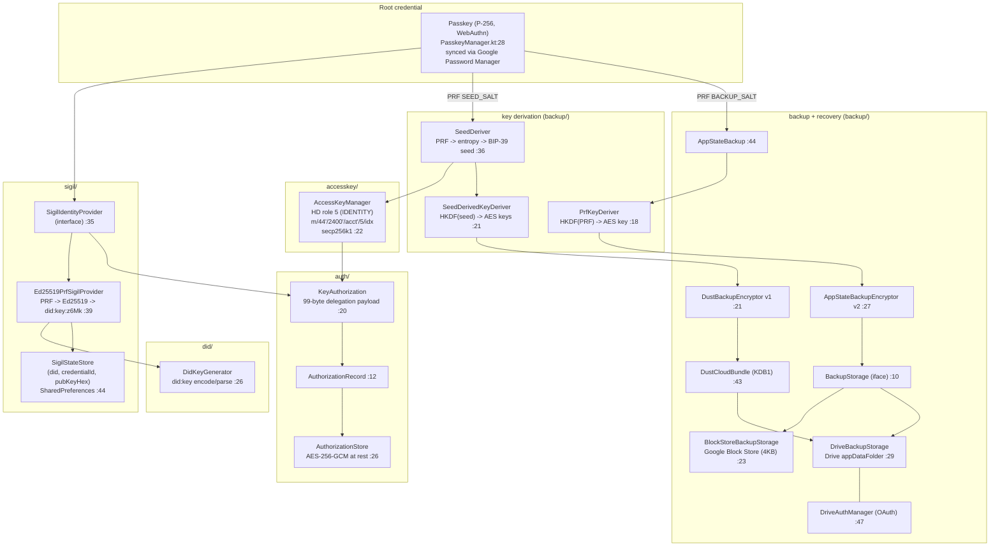
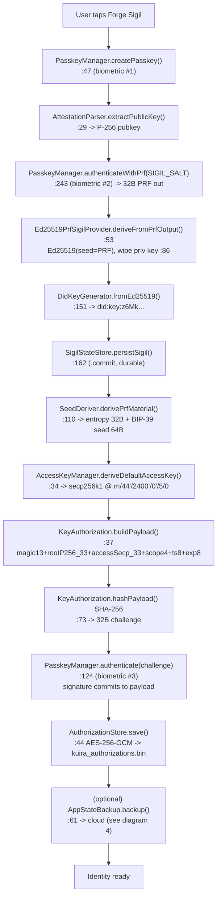
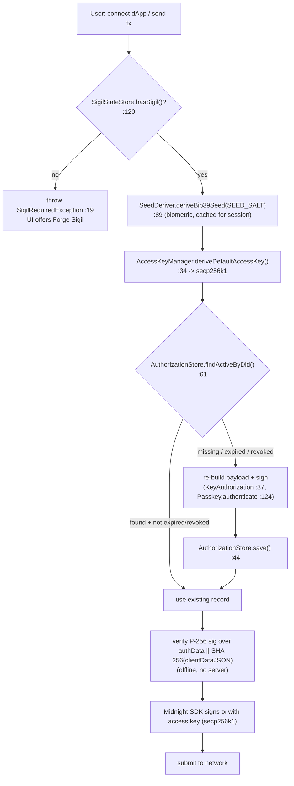
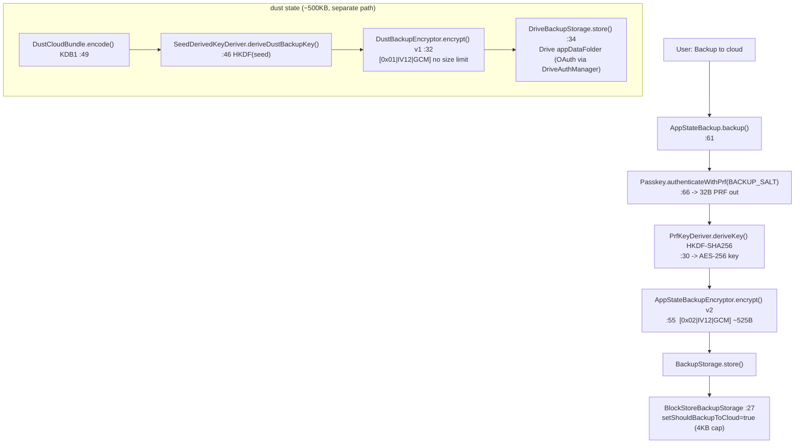
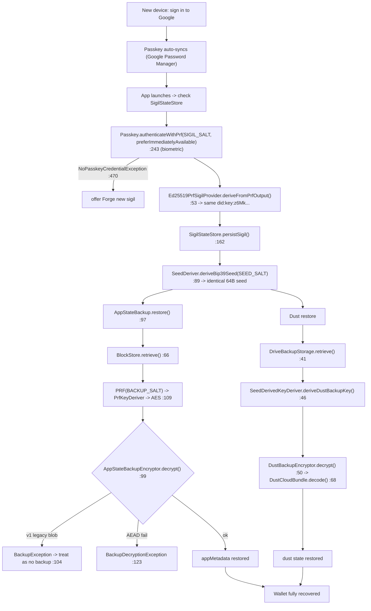

# Kuira Identity — Implementation Flowchart

Ground-truth map of the `core/identity` module as currently wired (not aspirational). Source cited inline as `file:line`. Stubs/future work are listed at the bottom and are deliberately kept out of the flow diagrams.

The whole system hangs off one root secret: the **passkey**. Every long-lived secret is re-derived on demand from a passkey **PRF** output using three domain-separated salts, so nothing sensitive has to be stored or synced in the clear.

| Salt | Constant | Derives |
|------|----------|---------|
| `SIGIL_SALT` | `SHA-256("kuira:sigil:v1")` (`SeedDeriver.kt:51`) | Ed25519 sigil DID |
| `SEED_SALT` | `SHA-256("kuira:seed:v1")` (`SeedDeriver.kt:39`) | BIP-39 wallet seed |
| `BACKUP_SALT` | `SHA-256("kuira:backup:v1")` (`AppStateBackup.kt:163`) | app-state backup AES key |

---

## 1. Architecture / component map

---

## 2. Enrollment — "Forge Sigil"

Three biometric taps in the full path: create passkey, derive sigil, sign the access-key delegation.

---

## 3. Unlock + sign a transaction

---

## 4. Backup (cloud-synced state)

Note: secrets are wiped after use (PRF + plaintext + derived key) e.g. `AppStateBackup.kt:83`, `AppStateBackupEncryptor.kt:88`. No seed is ever uploaded — it is re-derived on restore.

---

## 5. Recovery (new device, zero words)

---

## Key branch / error paths (cross-cutting)

- **No sigil** -> `SigilRequiredException` (`SigilRequiredException.kt:19`), UI offers Forge.
- **No passkey on device** -> `NoPasskeyCredentialException` (`PasskeyManager.kt:470`), offer Forge new.
- **Legacy P-256 DID** (`did:key:zDn...`) -> auto-migrated to Ed25519 on load (`SigilStateStore.kt:97`).
- **Legacy v1 backup blob** -> rejected as "no backup" (`AppStateBackup.kt:104`).
- **Wrong passkey / corrupted blob** -> AEAD `BackupDecryptionException` (`AppStateBackupEncryptor.kt:123`).
- **PRF unsupported** -> `BackupException("PRF not available")` (rare on Android; Google PWM supports PRF).
- **Drive not consented** -> `DriveConsentRequiredException` (`DriveAuthManager.kt:86`) / `NeedsConsent` outcome triggers consent UI.

## Not in the diagrams (stub / future, per IDENTITY_INVESTIGATION.md)

- CredentialProvider Mode 2 (Kuira as system passkey provider).
- Per-dApp access keys (`AccessKeyManager.deriveAccessKeyAt(index>0)` exists but routing/policies not wired).
- MCP agent pairing, "My Sigil" dashboard screen.
- Direct passkey-signed Midnight txs (if protocol adopts P-256), DRek social recovery, passkey-derived secp256k1 (would remove access-key cloud backup).
