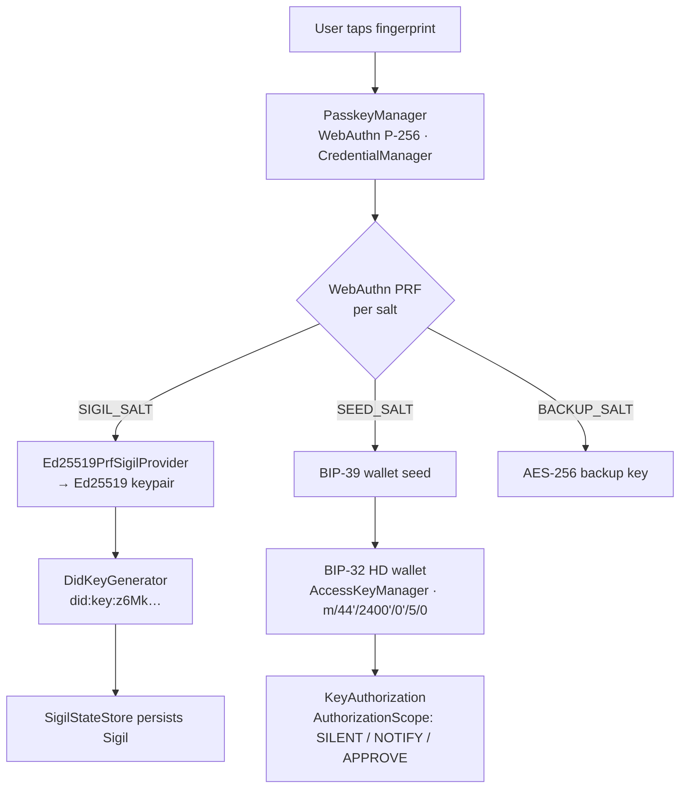
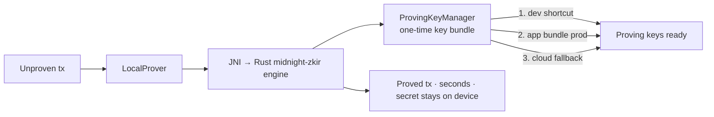
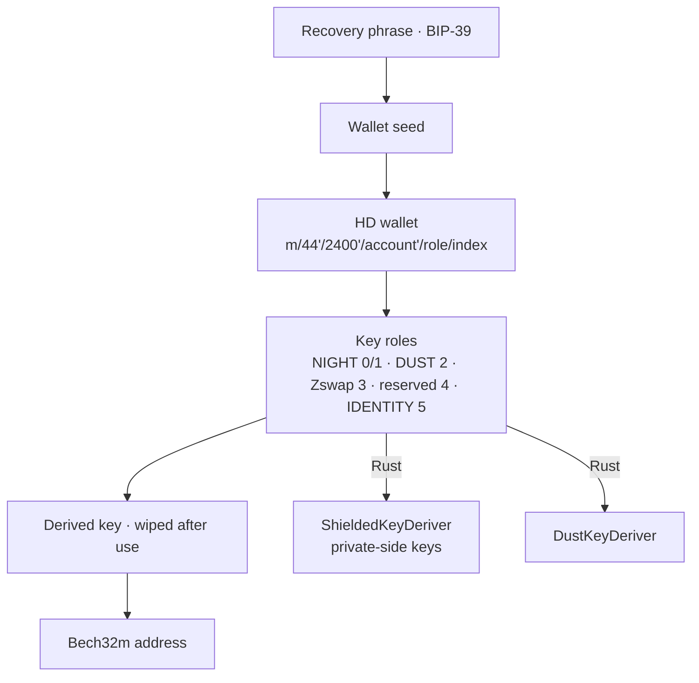
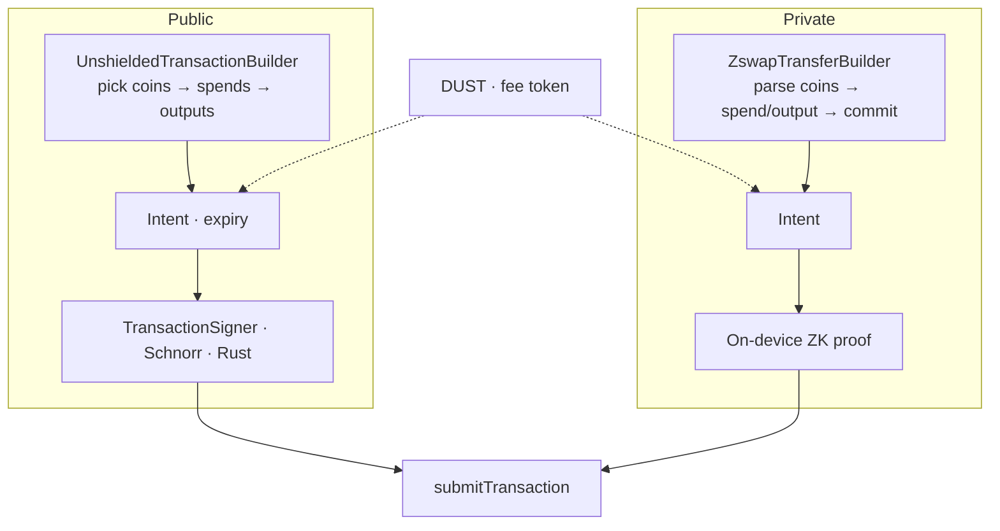
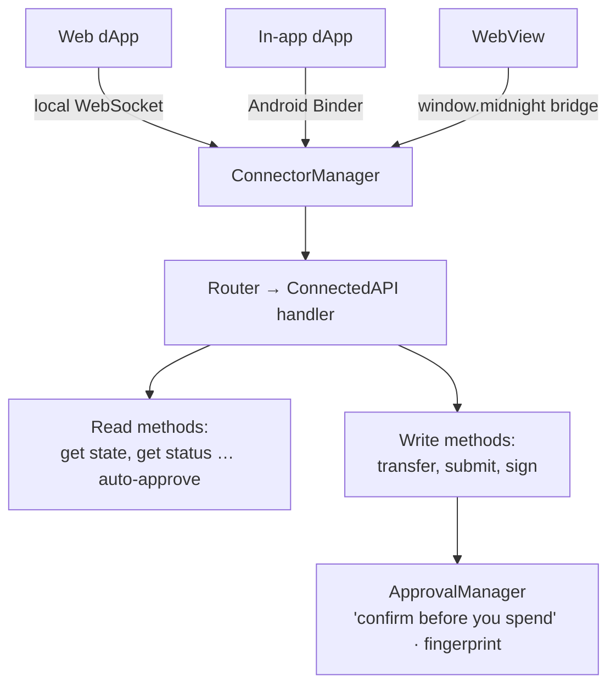
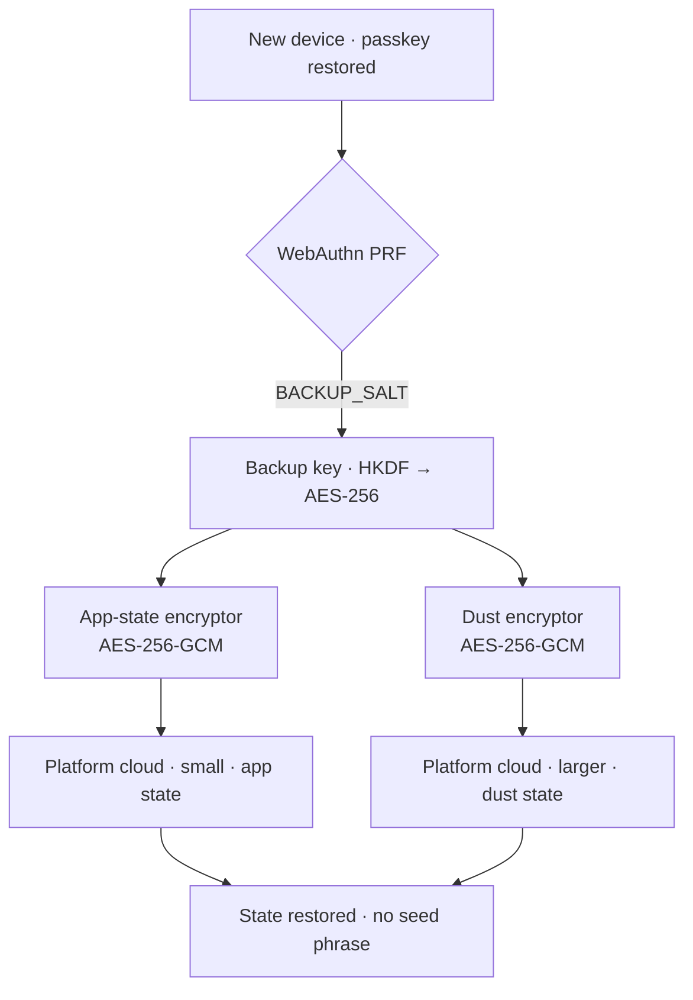

# Kuira Dev Hangout (with Jay) — The SDK, end to end

*Presenter speaking script for a developer hangout co-hosted with Jay Albert.*
*Format per slide: **SAY** = what we say out loud (plain language, read it straight). **ON SCREEN** = what the slide shows. **IF ASKED** = the deeper technical answer, parked for Q&A so we keep credibility without losing the room.*
*Kuira is not a wallet. It's a Sigil. This doc is the long version of that sentence.*

> **A note on voice:** this is the talk where we own what we believe — say it in the first person, with conviction. We are not speaking for Midnight, and our thesis does not rest on anyone else's authority. Where we nod to others in the ecosystem who reached the same conclusion, keep it secondary and clearly theirs — validation, never the basis for our argument.

---

## How to run this session

Jay's five beats, re-timed for the **full version with all six module flowcharts** (~47 min). This is the "most of the hangout" version he asked about.

| Time | Jay's beat | What we're doing |
|---|---|---|
| **0:00–8:00** | **1. What is it** | The shape everyone copied ("connect wallet"), what a Sigil is, and that it's literally in the code. |
| **8:00–15:00** | **2. Why we built it** | Identity vs. custody. Why the root is a passkey, not a social account. |
| **15:00–32:00** | **3. What's out of the box** | One Gradle line + the starter, the full module map, then six module deep-dive flowcharts. The technical meat. |
| **32:00–43:00** | **4. What we built with it** | **Midnight Kicks** + a short live demo. The fun part. Protect this time. |
| **43:00–47:00** | **5. Call to action** | The `SigilIdentityProvider` seam and where we need help. Leave the "where we are" slide up for Q&A. |

> **If the slot is shorter (compress to ~35):** in beat 3, show only three flowcharts live — **Identity, On-device Proving, Recovery** — and say "Crypto, Transactions, and Connector are in the doc." Trim the social-login contrast in beat 2 to one line. You still land the whole arc, and Kicks keeps its time.

---

# Beat 1 — What is it (0:00–8:00)

## Slide 1.1 — The thing everyone copied

**SAY:**
"Every chain inherited the same shape. You install a wallet, and then you 'connect wallet' to everything you do. The wallet is a separate app standing at the door, and you walk over to it every time you need to sign something. Today's wallets are genuinely good at that shape. But it is still that shape: one wallet app in the middle, and a little 'Connect Wallet' popup in front of every experience.

Here is what we believe, and it is the seed of Kuira. You shouldn't need a wallet. You need an identity. That is the bet we are making. You will hear versions of this across the Midnight community, so we are not alone in the instinct — but the conviction is ours, and so is the opinion about where that identity should live."

**ON SCREEN:** the "Connect Wallet" modal everyone knows, and our thesis: ***You shouldn't need a wallet. You need an identity.***

**DELIVERY NOTE:** this is also our "we kept landing on this exact thing while ideating" moment. The instinct people keep arriving at independently (social login, embedded wallets, no seed phrase) is real. Kuira is our answer to it, with a specific opinion about *where the identity lives*. That opinion is the whole talk.

## Slide 1.2 — What is a Sigil?

**SAY:**
"So what is a Sigil. If you have watched Game of Thrones, you already know the word from the first episode. Five direwolf pups, one for each Stark child, and the line is 'the direwolf is the sigil of your house.' A sigil wasn't decoration. It was who you were. Go back further and a sigil was a personal seal, the stamp you pressed into wax on a letter. And that seal said three things at the same time: I am this person, I authorize this, and I vouch that it is real.

That is already more than a wallet does. A wallet just holds things. A Sigil proves who you are, authorizes what apps can do for you, and protects your private data. Balance, send, receive, the usual wallet stuff, that is just one corner of it. The product is the seal, not the coin purse."

**ON SCREEN:** the three-promise table.

| | The promise | In plain terms |
|---|---|---|
| **Identity** | *"I am"* | Your root: a passkey plus your fingerprint. Not 24 words to write down. |
| **Authority** | *"I authorize"* | What you have allowed each app to do on your behalf, and nothing more. |
| **State** | *"I protect"* | Your private data, encrypted, that travels with you between apps. |

**SAY (acronym note, read it):** "Quick definition we'll use all talk: a **passkey** is the fingerprint-or-face login your phone already uses for apps and websites. No password, no phrase. That is the root of the whole thing."

## Slide 1.3 — The Sigil is in the code, not just a slide

**SAY:**
"And we want to be clear that the Sigil is not a marketing metaphor. It is literally in the code. Apps build against an interface named `SigilIdentityProvider`. A user's identity comes back as a `SigilDerivation`. It lives in a `SigilStateStore`. Even the errors speak the language: if there is no identity yet, you get a `SigilRequiredException`, which just means 'forge a passkey first.'

We made that interface swappable on purpose. Identity standards shift over long time horizons, so the thing behind the Sigil has to be replaceable without rewriting every app on top of it. That is why a future Midnight Passport, if that happens, is a component swap for us, not a rebuild."

**ON SCREEN:** the interface.

```kotlin
interface SigilIdentityProvider {
    // One biometric prompt -> the user's permanent identity.
    suspend fun deriveSigilDid(
        activity: Activity,
        passkeyManager: PasskeyManager,
    ): SigilDerivation
}

data class SigilDerivation(
    val did: String,          // did:key:z6Mk… (a decentralized identifier)
    val credentialId: String, // the passkey that produced it
)
```

**SAY (closing the slide):** "One fingerprint tap, one object back, and that is everything an app needs to act under your seal."

**IF ASKED:** `did` stands for DID (decentralized identifier), which is just a portable ID string that is not owned by any company. The `did:key:z6Mk…` format encodes a public key directly in the ID.

---

# Beat 2 — Why we built it (8:00–15:00)

## Slide 2.1 — Identity, not custody

**SAY:**
"The question we get most is: isn't this just one of those custody or social-login wallet services with extra steps. And the answer is no, and the difference is the whole point.

Those services are custody infrastructure. You call out to them, and they hold or co-hold your keys on servers. The Sigil is not custody. The wallet lives inside the app itself, backed by your passkey and by proving things on your own phone. And it is more than a wallet. It is identity, plus per-app permissions, plus your private state. The cloud only ever sees scrambled, encrypted blobs. It never sees what your data actually is."

**ON SCREEN:** "Custody services: keys on someone's servers" vs. "Sigil: identity on your device, the cloud sees only encrypted blobs."

**IF ASKED:** the custody players use MPC (multi-party computation, where a key is split across servers so no single one holds it) or secure enclaves. That is fine engineering, it is just a different trust model. Ours keeps the secret on the phone.

## Slide 2.2 — The privacy question (the one worth slowing down for)

**SAY:**
"Now the deeper question, and this is the one that makes people sit up. If Sigils are privacy-preserving identities, how does social login fit at all. Wouldn't making your social account your identity break Midnight's whole privacy model.

It would. So we don't. The trick is a distinction: identity versus login-and-recovery.

The root of your Sigil is a passkey, which lives in your phone's secure hardware. Your secret seed is generated from that passkey. Your social accounts never enter that calculation. They are not part of how your identity is built. The only thing the platform does is sync and back up the passkey itself, which is an account-level convenience that lives off to the side, off-chain, and is never part of your public identity."

**ON SCREEN:** the contrast table.

| Approach | Where identity is rooted | The catch |
|---|---|---|
| **Social-login identity** | The login identity itself, plus a user salt, with a zero-knowledge proof hiding the login token. | The login provider is structurally baked into your address, and it leans on a salt service plus a prover plus the provider's keys. |
| **Social key-share custody** | Key-shares retrieved through your social login. | The provider sits in the identity and recovery path, which is a liveness and centralization dependency. |
| **Kuira (Sigil)** | The **passkey**. Social stays purely behind it. | No link between your on-chain Sigil and your login provider. |

**SAY (land the point):** "So to the privacy question directly: social is never in your public footprint by default. The only time it shows up is if you choose to, selectively, like presenting a credential that says 'this Sigil controls this handle' for reputation. And even that can be done as a zero-knowledge proof so the handle stays hidden. That is disclosure, not identity. The one-liner is: social sits behind the Sigil as login and recovery, never as the identity itself."

**IF ASKED (define the acronyms):**
- The social-login approach roots in OIDC (OpenID Connect, the standard behind "sign in with your social account") fields plus a salt; the JWT (JSON Web Token, the login token your browser gets) is kept off-chain with a ZK (zero-knowledge) proof.
- "salt" just means an extra secret value mixed in so two people logging in the same way don't collide.

## Slide 2.3 — Apps carry the wallet, not the other way around

**SAY:**
"There is one more 'why,' and it is about shape. The normal model is centralized. One wallet app owns your account, and every other app has to knock on its door. Kuira takes the modular road instead.

Step one: an app on its own. A developer drops in our SDK (software development kit, the library you build with), and that app can create and use a Midnight identity by itself. No external wallet needed. The app provides the account.

Step two: now the user installs Kuira. Kuira does not show up as a gatekeeper. It shows up as a provider. It upgrades that same identity to phone-hardware-grade security, and it shows it in one place called 'My Sigil,' next to every other app you have sealed.

Every Midnight wallet comparison chart has a row called 'account abstraction' marked 'not yet.' This is our answer to that, and our answer is lighter, not heavier. The application provides the account, and the Sigil makes it trustworthy. It is not a better wallet. It is a different shape."

**ON SCREEN:** centralized (one wallet, everyone knocks) vs. modular (app provides the account, Sigil upgrades it).

**IF ASKED:** "account abstraction" is the idea that your account can be smarter than a raw keypair: spending rules, recovery, permissions. Most chains bolt it on at the protocol level. We push it up into the app and let the Sigil vouch for it.

---

# Beat 3 — What's available out of the box (15:00–32:00)

## Slide 3.0 — One Gradle line, then the starter

**SAY:**
"Okay, let's get concrete about what you can actually pick up and use today. It is published on Maven Central, which is the standard place Android libraries live, so it is one line in your build file. There are three pieces."

**ON SCREEN:** the artifact table + the one-liner.

| Artifact | What you get |
|---|---|
| `io.github.kuiralabs:dapp-ui` | Drop-in Compose wallet UI: Sigil identity, backup and restore, dust, the floating panel chips. |
| `io.github.kuiralabs:midnight-sdk` | Headless: contracts, on-device proving, balance, transactions. Bring your own UI or agent. |
| `io.github.kuiralabs.contract` *(Gradle plugin)* | Compiles your `.compact` contracts and bundles the proving files into your app. Applied in the `plugins {}` block — not added with `implementation`. |

```kotlin
implementation("io.github.kuiralabs:dapp-ui:0.1.0-alpha04")   // the UI panel
// or, headless:
implementation("io.github.kuiralabs:midnight-sdk:0.1.0-alpha04")
```

**SAY (the starter):**
"And if you just want to see it run, there is a starter repo called `kuira-starter-android`. Clone it, build it, run it, five minutes. It ships the whole loop in a tiny app: a Sigil identity from your fingerprint, an embedded wallet with balance and a receive QR (the square barcode) and a network switch, and a six-line smart contract with live, reactive state. Our floating panel drops two draggable chips over your app, an identity chip and a wallet chip, so you get identity and balance one tap away without building any wallet screen yourself. Four config steps and it is your own dApp."

```bash
git clone https://github.com/kuiralabs/kuira-starter-android.git my-dapp
cd my-dapp
./gradlew :app:assembleDebug
```

**DELIVERY NOTE:** this is the "you could have a Midnight dApp with passkey identity by the end of this hangout" line.

---

## Slide 3.0b — The module map (everything under the hood)

**SAY:**
"Before the deep-dives, here's the whole map, because those two Maven artifacts sit on top of a real multi-module engine. Eleven `core` modules of pure Kotlin and Rust with no UI, then the SDK layer that packages them for you. You don't import these one by one — you import the SDK and it wires them together. We'll walk six of them as flowcharts in a second; the rest are on this slide so you can see the actual shape of the thing."

**ON SCREEN:** the module map.

### `core/` — the engine (pure Kotlin + Rust, no UI)

| Module | What it does | Deep-dive |
|---|---|---|
| `core:crypto` | The key tree — BIP-39/32 derivation, Schnorr/secp256k1 signing, Bech32m addresses, the dust + shielded key derivers. | Slide 3.3 |
| `core:identity` | The Sigil itself — the DID (`did:key`) from the passkey PRF, the `SigilIdentityProvider` seam, the Sigil state store. | Slide 3.1 |
| `core:auth` | Biometric + hardware gating — the fingerprint ceremony, the encrypted `SeedVault`, and key-access policy. | Slide 3.1 |
| `core:ledger` | Builds, signs, and submits transactions (public + private); the native Midnight ledger bindings; dust fees. | Slide 3.4 |
| `core:wallet` | The balance engine — turns raw ledger events into your spendable balance and coin set. | Slide 3.4 |
| `core:indexer` | The chain's local view — the UTXO + dust database (Room) and the sync that keeps it current. | — |
| `core:connector` | How outside apps reach the Sigil — the WebSocket/Binder/WebView transports, the JSON-RPC router, the approval manager. | Slide 3.5 |
| `core:compact-engine` | Runs Compact smart-contract calls — evaluates ledger operations and supplies their proofs (the contract runtime). | Beat 4 |
| `core:network` | Network configuration — PreProd / Undeployed / RPC endpoints, device detection. | — |
| `core:designsystem` | The Compose design system — the "Void" theme + palette, the Rarámuri runner, shared UI. | — |
| `core:testing` | Shared test fakes and utilities. | — |

### `sdk/` — the developer surface (this is what you actually import)

| Module | What it does |
|---|---|
| `sdk:midnight-sdk` *(Maven)* | The headless entry point — `MidnightSdk`: contracts, **on-device proving (Slide 3.2)**, balance + dust sync, transactions. |
| `sdk:dapp-ui` *(Maven)* | The drop-in Compose UI — the floating pills, the wallet sheet, backup, dust. No wallet screen to build. |
| `sdk:wallet-runtime` | The runtime services behind the SDK — session lock, network preference, sync-phase labels, background alerts. |
| `sdk:wallet-seed` | Seed + recovery — the Sigil session, the recovery-phrase manager, the secure seed store. |
| `sdk:contract-plugin` *(Maven)* | The Gradle plugin (`io.github.kuiralabs.contract`) — compiles `.compact` and bundles proving keys at build time. |

**SAY (the feature layer, one line):** "There's also a `feature/` layer — balance, dust, onboarding, send, settings — which is the screens of the consumer Kuira app we're still building. Everything above the feature layer is what ships in the SDK today."

**DELIVERY NOTE:** do not read this table row by row. Point at it, say "eleven core modules, the SDK packages them," and move into the flowcharts. It's a credibility slide — *this is a real architecture, not a demo* — and the six deep-dives that follow each go deeper on one or two of these modules.

---

> The next six slides are the module tour. Same rhythm each time: one sentence of what it does for you, the flowchart on screen, and the real algorithm names parked in IF ASKED. Granular code is in the repo. This is the mental model.

## Slide 3.1 — Identity: one tap becomes your whole key world

**SAY:**
"This is the heart of it. One fingerprint ceremony produces three separate secrets from the same passkey: your identity, your wallet seed, and your backup keys. Nothing gets written on paper. The way it does that is a feature of modern passkeys called PRF, which you can read as 'a function that turns your fingerprint into the same secret every time, deterministically.' We feed it three different labels and get three independent secrets out."

**ON SCREEN:**



**SAY (the one durable idea):** "The important idea: your seed is derived from your passkey, so it is the same on every device and it is never derived from anything social."

**IF ASKED (define everything on the diagram):**
- WebAuthn = the web standard behind passkeys. PRF = pseudo-random function (the fingerprint-to-secret trick), also called the HMAC-secret extension.
- "salt" = a fixed label we mix in; three salts, three independent secrets.
- Ed25519 and P-256 = two kinds of cryptographic keys; the identity key is Ed25519.
- BIP-39 / BIP-32 = Bitcoin Improvement Proposals, the standards for the recovery phrase and the key tree. HD wallet = hierarchical deterministic (one seed, an organized tree of keys).
- Reconciliation note: the current code derives the identity as Ed25519 and auto-migrates the older P-256 identity that early design docs describe. If someone read the old design, that is why.

## Slide 3.2 — On-device proving: proofs in seconds, no server

**SAY:**
"Midnight transactions need a zero-knowledge proof, which is a piece of math that proves something is true without revealing the secret behind it. Most setups make that proof on a server you have to run. We make it on the phone. The secret never leaves the device, and there is no proof server to operate."

**ON SCREEN:**



**SAY:** "On a phone, in seconds, and the private part of the transaction never goes anywhere."

**IF ASKED:**
- ZK = zero-knowledge. The engine is Rust (`midnight-zkir`) reached over JNI (Java Native Interface, the bridge from Kotlin code to native code). Deliberately no WASM (WebAssembly) on Android; it is precompiled native for speed.
- The proving keys load three ways: an adb (Android Debug Bridge) shortcut in dev, bundled in the app for production, or a cloud-storage fallback. (Exact size depends on the circuits — not worth a number on a slide.)
- `ProvingMode.LOCAL` is the default; `REMOTE` exists only as a fallback and matches the proof server's input/output format.

## Slide 3.3 — Crypto: your keys and addresses

**SAY:**
"Underneath, everything grows from one secret like a family tree. One root, and every key you will ever need branches off it in a predictable way. Same root, same branches, every time. That is exactly what lets your wallet rebuild itself on a new phone with nothing written down. Each branch has a job: your public balance, the fee token, your private money, and your identity. And two things we genuinely care about here: the moment we finish using a private key we wipe it from memory, and the addresses you copy and paste use a format that catches a single mistyped character instead of sending your money into the void."

**ON SCREEN:**



**SAY (token aside):** "Quick vocabulary: NIGHT is the main token, DUST is the fee token you spend to transact, and Zswap is the private, shielded side of the ledger."

**IF ASKED:**
- BIP-39/32/44 = the recovery-phrase, key-tree, and account-numbering standards. Role 4 in that list is reserved/unused today; identity sits at role 5, just past Midnight's standard roles.
- Bech32m = the typo-resistant address format (fixes an earlier format's mutation weakness).
- The curve math (secp256k1 for signing; JubJub over BLS12-381 for the private side; Blake2b hashing) runs in Rust for speed; the auditable parts are pure Kotlin. Wallet-interop detail is in the repo's compatibility doc (BIP-39 here returns the full 64-byte seed).
- **Two 256-bit curves, and a planned simplification:** passkeys natively produce **P-256** (secp256r1) keys, but **Midnight signs with secp256k1** — a *different* 256-bit curve. So today the identity module bridges them, deriving the secp256k1 keys the wallet needs from the P-256 passkey root. Google's (and Apple's) passkeys already speak P-256; the plan is to drop that conversion once Midnight natively supports P-256, so the passkey produces the right key end to end with nothing to translate in our module.

## Slide 3.4 — Transactions: public and private, one model

**SAY:**
"Two kinds of money movement, one mental model. Public transactions are like normal on-chain transfers, out in the open. Private transactions are shielded, where the amounts and parties are hidden and we prove the move is valid on-device. Both end at the exact same place, one submit call, whether the money was public or private."

**ON SCREEN:**



**SAY:** "Same destination either way. The app does not have to care which world the money came from."

**IF ASKED:**
- Schnorr (specifically BIP-340) = the signature method for public transactions. Zswap = the shielded layer. "Intent" segments split into guaranteed vs. fallible parts. UTXO (unspent transaction output) = the "coins" the public builder selects from. TTL = time to live, the expiry on a transaction.

## Slide 3.5 — dApp connector: how apps talk to the Sigil

**SAY:**
"This is how outside apps talk to your Sigil. The rule is simple and safe: reading your state is automatic, but anything that spends money requires your explicit approval. There are three ways an app can connect, covering web apps, native in-app experiences, and embedded web views, and all three speak the same standard that Midnight wallets use, so anything built for a Midnight wallet already understands Kuira."

**ON SCREEN:**



**SAY (the forward-looking bit):** "That 'confirm before you spend' step is the same safety idea that scales to AI agents later, which we'll come back to at the end."

**IF ASKED:**
- The shared standard is Midnight's ConnectedAPI, spoken over JSON-RPC 2.0 (a simple request/response format). The three transports are a WebSocket (live web connection), Android Binder (the system's app-to-app channel), and a WebView bridge (`window.midnight`).

## Slide 3.6 — Recovery: zero words

**SAY:**
"And this is the payoff of rooting in a passkey. New phone. Your passkey syncs over automatically, your fingerprint unlocks it, and because the secret is derived from that same passkey, the exact same backup key comes back. So your encrypted state restores with zero words and zero passwords. There is no recovery phrase to lose, and there is no company sitting in the middle who can lock you out."

**ON SCREEN:**



**SAY (handle the hard question head-on):** "The honest version of the scary question, 'what if I lose my device and my social account,' is this: recovery is in the code today, passkey sync plus the fingerprint-derived key that decrypts your cloud backup. There is no provider in that path to lock you out. A guardian-style social recovery, where friends can help you back in, is exactly the kind of thing that slots in behind that swappable interface later, as a recovery option, never as your identity."

**IF ASKED:**
- AES-256-GCM = a standard, strong encryption method. HKDF (RFC 5869) = a standard way to turn one secret into a purpose-specific key. The passkey itself is custodied by the platform's password manager, which is platform-layer and off-chain, not part of your public identity.
- **How it works today (Google), and next (iOS):** on Android the passkey lives in **Google Password Manager** — synced across the user's devices and backed up to their Google account — and the encrypted state blobs travel via Google's **Block Store**. On iOS it's the same model with Apple's pieces: the passkey synced through **iCloud Keychain**, the blobs through iCloud. Either way the platform only ever moves the *passkey* and *encrypted blobs* — never your identity or your data. And because this whole login-and-recovery layer sits behind `SigilIdentityProvider`, a developer who wants to use their own social/recovery backend swaps it in there — the "social behind the Sigil" point from Beat 2, never the identity itself.

---

# Beat 4 — What we built with it: Midnight Kicks (32:00–43:00)

> **Protect this block. This is the fun the room came for.** Aim for ~4 min of setup and ~6–7 min of live demo.

## Slide 4.1 — Midnight Kicks

**SAY:**
"This is the proof that the whole stack holds up under a real app. Midnight Kicks is a zero-knowledge penalty shootout. It is Unity 3D for the game, Kotlin for the wallet and identity, and a Midnight smart contract acting as the referee. Two players, five rounds, and a commit-then-reveal design so neither player can cheat by peeking. The contract is the impartial ref, and every proof is made on the players' own phones."

**ON SCREEN:** a Kicks screenshot or short loop, and the one-liner: *"Unity 3D + Kotlin + a Compact contract as the referee."*

**IF ASKED:** "commit-reveal" means each player first submits a sealed, hidden choice (the commit), and only after both are locked in does each reveal it. The contract checks the reveal matches the commit, so no one can change their move after seeing the other. Unity is integrated as UaaL (Unity as a Library, so the game runs inside the Kotlin app).

## Slide 4.2 — What it exercises (mapped back to the modules)

**SAY:**
"And it is not a toy. It exercises every module we just walked through. Players are matched by their Sigil, and matches survive the app being killed and reopened. The penalty contract runs its proofs locally, no server. The contract itself is deployed at runtime as the referee. And the match state is encrypted and travels across devices, which is the same recovery path from a minute ago."

**ON SCREEN:** four bullets tied to the module icons.
- **Identity** — players matched by Sigil; matches resume across process death.
- **On-device proving** — 7 proof circuits, every proof made on the phone.
- **Smart contracts** — a Compact contract deployed at runtime as the ref.
- **Shielded state + recovery** — encrypted match state moves across devices.

## Slide 4.3 — Live demo

**SAY (lead-in):** "Let's just show you."

**DEMO SCRIPT (keep it tight):**
1. Forge a Sigil with a fingerprint. (Show: no password, no phrase.)
2. Join a match by deep-link. (Show: matched by identity.)
3. Commit your move, then reveal one round. (Show: the contract is the ref.)
4. Show the on-chain result. (Show: it is real, it settled on Midnight.)

**SAFETY NET:** if conference Wi-Fi is risky, have a 30-second screen recording ready as backup. The point is "this is real and it is fun," not a full playthrough. Targeting a launch around the 2026 World Cup.

---

# Beat 5 — Call to action (43:00–47:00)

## Slide 5.1 — Where this goes, and the ask

**SAY:**
"Last thing, and it is where our conviction points hardest. The Sigil is built for what we are certain is coming next: agents. A world of agents transacting needs the two things humans take for granted — a private identity, and a safe way to authorize spending. That is exactly what we built the Sigil to be. 'Approve this payment' becomes a fingerprint, the proof is made on the device, and you can tell an agent 'spend up to this much per day, and ask me past that.' It is a future Midnight's leadership is vocal about too — trillions of agents, proofs as their language — and we are building the identity layer it will need.

So here is our ask. The whole design hinges on one seam, that `SigilIdentityProvider` interface. Today it is passkey plus fingerprint. Tomorrow it could be social login, or Midnight Passport, or guardian recovery, all behind the same interface, none of them touching the apps on top. Getting that interface right, so anyone can plug in their own backend, is exactly where we want help. If you have thought about social auth, recovery, or open wallet standards, let's compare notes."

**ON SCREEN:**
- **Try it:** `git clone kuiralabs/kuira-starter-android` -> running dApp in minutes.
- **Read it:** kuiralabs.github.io/kuira-sdk-android.
- **Build the seam with us:** the identity provider interface and the providers behind it.

**IF ASKED:** the agent tooling is a privacy-native companion CLI (command-line interface) and MCP (Model Context Protocol, the standard that lets AI tools plug into systems) bridge. It is on the roadmap, not today's talk.

## Slide 5.2 — Where we honestly are (leave up during Q&A)

**SAY:** "And no vapor. Here is honestly what is shipped versus what is next. We'll leave this up for questions."

**ON SCREEN:**
- **Shipped and working:** the crypto engine; public and private transactions end to end; on-device proving (seconds, no proof server); the dApp connector (the standard Midnight wallets use); an embeddable SDK on Maven Central with the starter and Midnight Kicks as live consumers; the Sigil product framing, store, and navigation.
- **Designed and next:** passkey onboarding polish and the "My Sigil" per-app permissions dashboard; the on-phone agent runtime (rule-gated spending, the MCP bridge) and its companion CLI; and iOS and React Native SDKs on the roadmap, iOS first.

**SAY (close):** "Kuira version 1.0 ships as a reference Sigil for the ecosystem, technical audience first, with the full consumer vision phased right behind it."

---

### The one-paragraph version (if someone walks in late, or for a recap)

> Most chains make you install a wallet and "connect" it to everything. We believe you shouldn't need a wallet — you need an identity. Kuira is that: a Sigil, "I am, I authorize, I protect," that lives inside apps instead of in front of them, signs with a fingerprint instead of a seed phrase, roots in a passkey (never in your social accounts, which sit behind it for sync and recovery only), and proves things on your phone. Drop the SDK in with one line, clone `kuira-starter-android` to see it run, and play Midnight Kicks to watch it hold up under a real zero-knowledge app. The seam that makes it future-proof, `SigilIdentityProvider`, is where we are asking the community to build with us.
